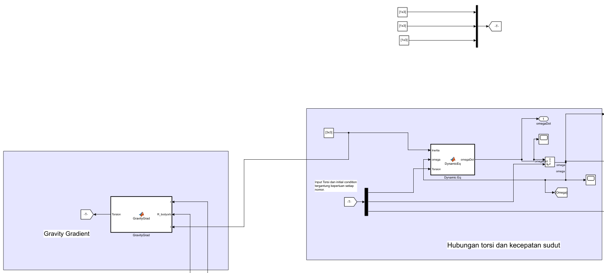
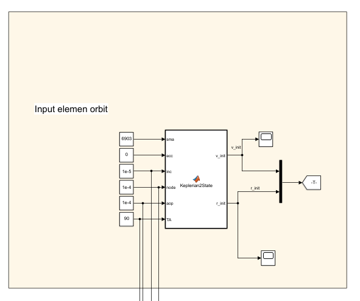
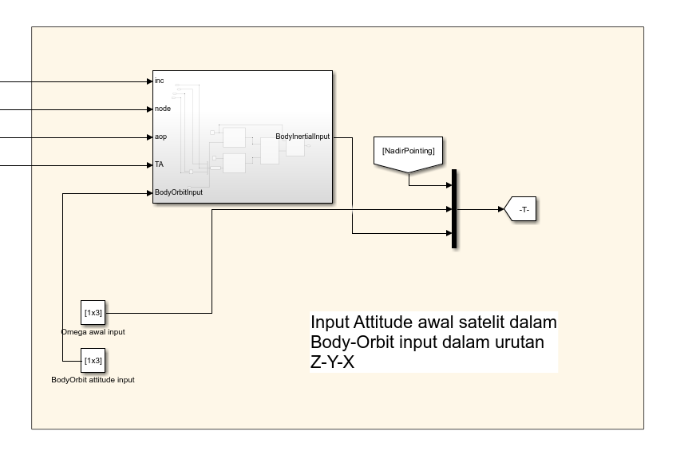
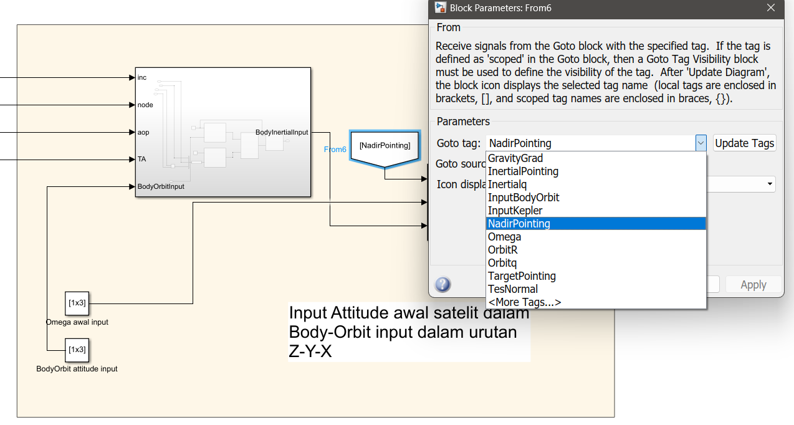
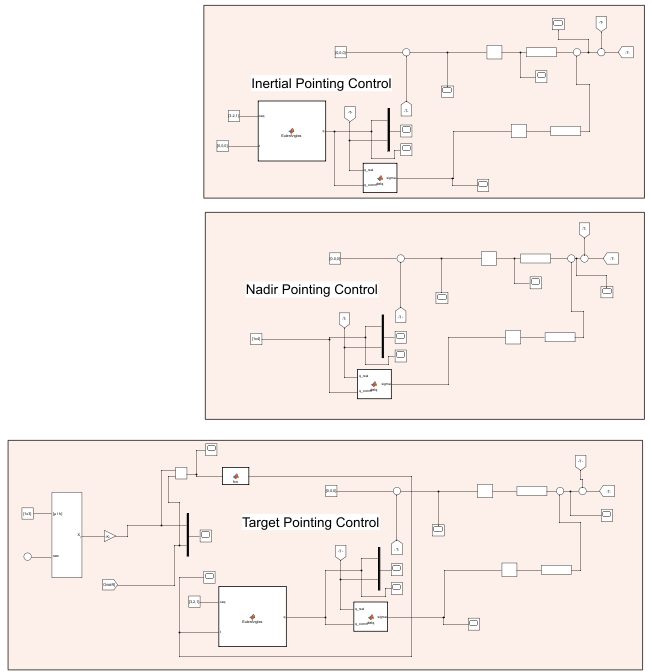
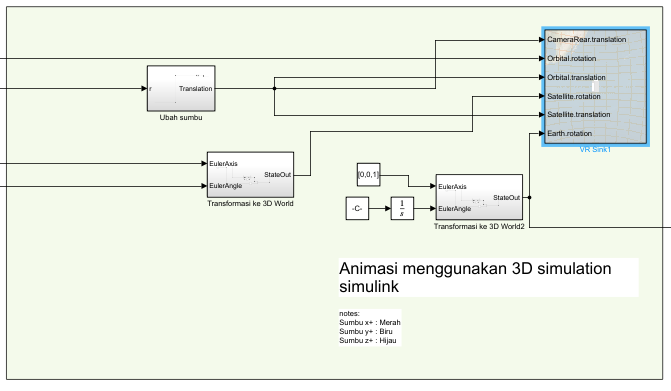
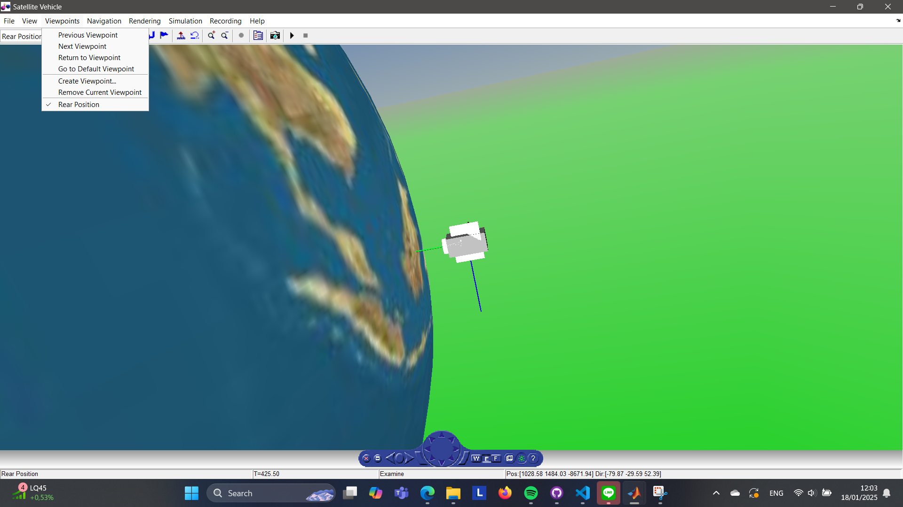

# satellite-attitude-control
Simulasi dibuat untuk memenuhi tugas AE4026 Attitude Dynamics & Control.
## Penyusun:
1. Hilmi Nuruzzaman
## Pembimbing:
1. Dr. Eng. Ridanto Eko Poetro, S.T, M.Sc.

# Cara menjalankan program
Program dibuat menggunakan SIMULINK, pastikan SIMULINK sudah terinstall sebelum menjalankan program.
## Petunjuk penggunaan
### 1. Buka SIMULINK, jalankan program DinsatHW7.slx
### 2. Atur data satelit seperti gravity gradient, inertia, dan torsi.

### 3. Input elemen orbit satelit dalam keplerian

### 4. Input mode kontrol yang akan digunakan dalam simulasi

Pastikan memilih antara NadirPointing, InertialPointing, atau TargetPointing pada menu berikut.

### 5. Input data kontrol yang dipilih pada blok berikut

### 6. Run simulasi
Untuk melihat satelit dengan 3D simulation simulink, pilih VR Sink 1 pada blok berikut.

Output 3D dapat dilihat sebagai berikut.

Output lain dapat dilihat pada scope yang diberikan, atau bisa menambah scope sendiri jika diperlukan.